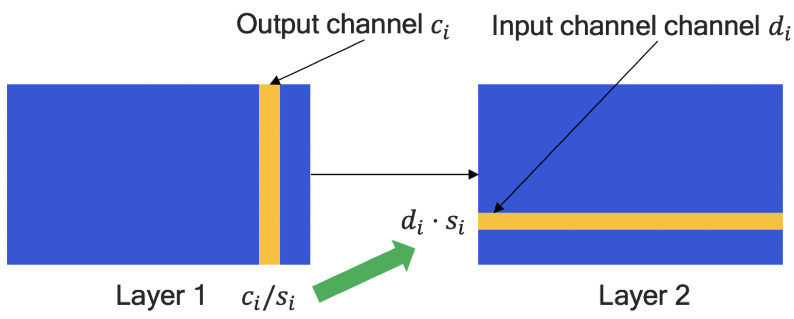
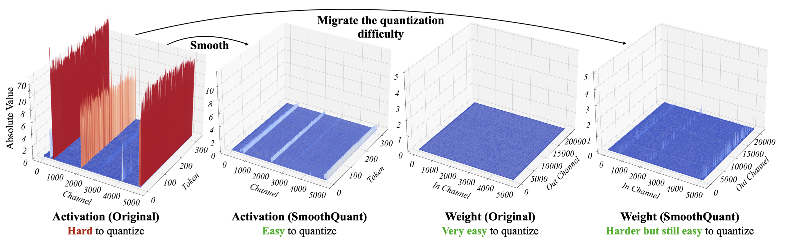

# EQuant

EQuant provides a collection of algorithms to improve post-training quantization (PTQ) accuracy and extends PyTorch observers and quantizers with new ones. It also implements basic fusion methods and extends PyTorch backend with new fusion recipes. All quantized models support quantization-aware training (QAT) mode.

## Installation

``` python
pip install -e .
```

## Basic Usage

``` python
from equant import generate_qconfig_mapping, quantize, convert


# define quantization recipe, for more details see below
qconfig = [
    {
        'weight': {
            'dtype': 's8',
            'qscheme': 'per_channel_symmetric',
            'observer': 'min_max',
            'quantizer': 'base'
        },
        'activation': {
            'dtype': 'u8',
            'qscheme': 'per_tensor_affine',
            'observer': 'min_max',
            'quantizer': 'base'
        },
        'layers': # list of layers for quantization
    }
]

# convert qconfig to PyTorch format
qconfig_mapping = generate_qconfig_mapping(model, qconfig)

# convert model to fake-quantized mode
qmodel = quantize(model, qconfig_mapping, example_inputs)

# calibrate model
for data in dataloder:
    _ = qmodel(data)

# convert the fake-quantized model to a quantized model
model_int = convert(qmodel)
```

## QConfig

QConfig is a list of dictionaries where each dictionary contains its own quantization recipe for specific layers:

```python
qconfig = [
    # scheme 1
    {
        'weight': {
            # quantization recipe for weights
        }
        'activation': {
            # quantization recipe for activations
        },
        'layers': # list of layers for this scheme
    },
    # scheme 2
    {
        'weight': {
            # another quantization recipe for weights
        }
        'activation': {
            # another quantization recipe for activations
        },
        'layers': # list of layers for this scheme
    }
    # scheme 3
    ...
    # scheme n
]
```

Each quantization recipe (for both weights and activations) contains information about:

* Data type &mdash; in the format [s/u][n_bits], where s means signed data type and u stands for unsigned data type; for special cases n_bits may be float number. For instance, s7.7, s5.9, u6, etc. are all valid data types.

* Quantization sheme &mdash; one of the followings:
    * per_tensor_symmetric
    * per_tensor_affine
    * per_channel_symmetric
    * per_channel_affine

* Observer &mdash; one of the followings:
    * min_max
    * moving_average
    * quantile
    * histogram (supports only per tensor granularity)

* Quantizer &mdash; one of the followings:
    * torch_base &mdash; scales and offsets are frozen
    * base &mdash; enables learnable scales and offsets
    * lsq &mdash; based on [Learned Step Size Quantization](https://arxiv.org/abs/1902.08153)

## QConfigMapping

QConfigMapping allows to save quantization scheme in yaml format to avoid its generation every time. Moreover, you can make sure that it was generated correctly and containes right information:

``` python

# generate qconfig mapping only once...
qconfig_mapping = generate_qconfig_mapping(...)

# ...and save it
qconfig_mapping.save('qconfig.yaml')

# then create it from existing configuration
qconfig_mapping = QConfigMapping.from_file('qconfig.yaml')
```

You are free to edit configuration file while it preserve correct values.

## Algorithms

There may be a large accuracy drop after PTQ stage and therefore there exists numerous bunch of methods to improve quantized model quality. EQuant provides implementation for some of them:

* Cross-Layer Equalization

```python
from equant.algorithms import cross_layer_equalization


model = cross_layer_equalization(model)
```

* Smooth Quant

```python
from equant.algorithms import smooth_quant


model = smooth_quant(model, qconfig_mapping, dataloder)
```

* Bias Correction

```python
from equant.algorithms import bias_correction


qmodel = bias_correction(qmodel, dataloder)
```

* AdaRound

```python
from equant.algorithms import adaround


qmodel = adaround(qmodel, dataloder)
```

### Cross-Layer Equalization

Migrates quantization difficulty between two consecutive linear layers.

<p align="center"></p>

For more details see [Data-Free Quantization Through Weight Equalization and Bias Correction](https://arxiv.org/abs/1906.04721).

### SmoothQuant

Migrates quantization difficulty between activations and weights. 



For more details see [SmoothQuant: Accurate and Efficient Post-Training Quantization for Large Language Models](https://arxiv.org/abs/2211.10438).

### Bias Correction

To reduce quantization error we can correct bias by adding the difference between expected outputs of full-precision and quantized models.

$$ b^{'} = b + E[W_{fp}x_{fp}] - E[W_{q}x_{q}] $$

For more details see [Data-Free Quantization Through Weight Equalization and Bias Correction](https://arxiv.org/abs/1906.04721).

### AdaRound

We can consider rounding during quantizaztion as an optimization task and find better parameters by chosing the appropriate rounding direction (up or down):

$$ W_{fake-q} = s \cdot \text{clip}\left(\left \lfloor \frac{W_{fp}}{s}\right \rfloor + h(V) + Z, n, p\right) $$ 

where $h(v)$ is any differentiable function that takes values between $0$ and $1$. For more details see [Up or Down? Adaptive Rounding for Post-Training Quantization](https://arxiv.org/abs/2004.10568).

## Fusion
As a rule, before quantization some layers need to be fused (such as linear layers and batch normalization) and for this purpose EQuant provides some fusion methods:

* Batch Normalization fusion

```python
from equant.fuse import fuse_conv_bn


model = fuse_conv_bn(model)
```

* One-kernel convolution fusion

```python
from equant.fuse import fuse_conv_conv1x1


model = fuse_conv_conv1x1(model)
```

* One-step residuals fusion

```python
from equant.fuse import fuse_residuals


model = fuse_residuals(model)
```

## References

* [Data-Free Quantization Through Weight Equalization and Bias Correction](https://arxiv.org/abs/1906.04721)

* [SmoothQuant: Accurate and Efficient Post-Training Quantization for Large Language Models](https://arxiv.org/abs/2211.10438)

* [Up or Down? Adaptive Rounding for Post-Training Quantization](https://arxiv.org/abs/2004.10568)

* [Learned Step Size Quantization](https://arxiv.org/abs/1902.08153)
